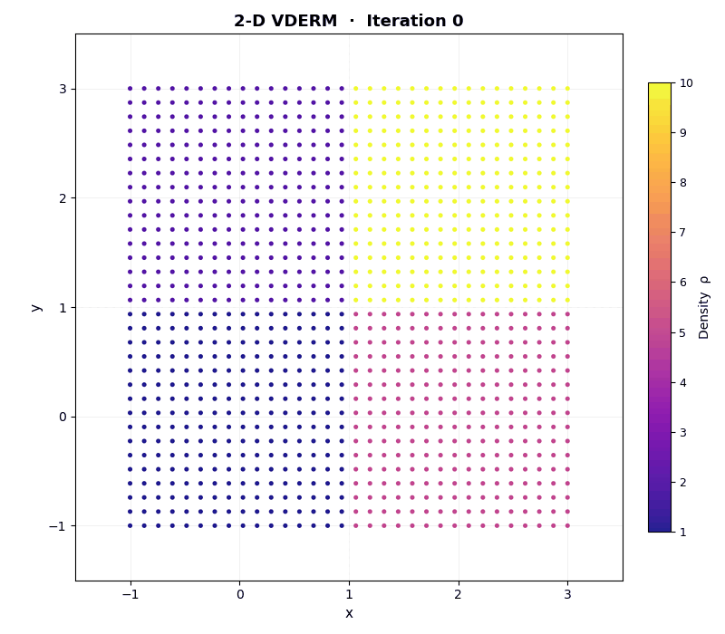

# pyVDERM 
[](https://badge.fury.io/py/pyVDERM)
[](https://github.com/jspector792/pyVDERM/releases)
[](https://www.python.org/downloads/)
[](https://opensource.org/licenses/MIT)

Volumetric Density-Equalizing Reference Map — a Python implementation of the VDERM algorithm for **3D shape deformation** and (new in v2.0) **2D cartogram generation** from GeoJSON / Shapefile inputs.

<table>
  <tr>
    <td align="center"><b>3-D shape deformation (cube)</b></td>
    <td align="center"><b>2-D cartogram (2×2 grid)</b></td>
  </tr>
  <tr>
    <td></td>
    <td></td>
  </tr>
</table>

## Overview

pyVDERM implements the Volumetric Density-Equalizing Reference Map (VDERM) method by [Choi & Rycroft (2020)](https://link.springer.com/article/10.1007/s10915-021-01411-4). VDERM is a 3D generalization of the diffusion-based cartogram method, enabling volume-preserving deformations of 3D objects based on prescribed density distributions.

v2.0 extends this to **2D** using the same diffusion-advection process — just one spatial dimension removed — making 2D cartograms straightforward to produce from standard geographic files (GeoJSON, Shapefile, GeoTIFF).

### Applications

- 3D data visualization and cartograms
- **2D geographic cartograms** from GeoJSON / Shapefiles (new in v2.0)
- Adaptive mesh refinement
- Shape modeling and morphing

### Key Features

- **3D**: Fast regular grid interpolation, XYZ / STL / VTK export, optional PyMeshLab mesh support
- **2D (new)**: GeoJSON and Shapefile input, GeoTIFF built-in densities, 2D heatmap / scatter visualization
- Comprehensive matplotlib animations for both pipelines
- Progress tracking with intermediate state exports
- Automatic grid sizing with customizable padding

## Installation

### Base / lite (no optional dependencies)
```bash
pip install pyVDERM
```

### With 2-D geographic I/O (GeoJSON, Shapefile, GeoTIFF)
```bash
pip install pyVDERM[2D]
```

### With 3-D mesh support (STL, OBJ, Poisson reconstruction)
```bash
pip install pyVDERM[3D]
```

### Full installation
```bash
pip install pyVDERM[all]
```

### Development
```bash
git clone https://github.com/jspector792/pyVDERM.git
cd pyVDERM
pip install -e .[all]
```

## Quick Start — 3D

```python
import pyVDERM as vd
import numpy as np

surface_points, normals = vd.create_pcd('mesh.stl', n_pts=25000)
params = vd.make_initial_grid(surface_points, max_points=32768)
grid = vd.VDERMGrid(params['shape'], params['h'], params['min_bounds'])

def my_density(x, y, z):
    r = np.sqrt((x - 1.5)**2 + (y - 1.5)**2 + (z - 1.5)**2)
    return 1.0 + 3.0 * np.exp(-5 * r**2)

grid.set_density(my_density)
result = vd.run_VDERM(grid, n_max=100, max_eps=0.02)

final_surface = vd.interpolate_to_surface(
    surface_points, params, result.get_displacement_field()
)
vd.export_mesh_file('deformed_mesh.stl', final_surface)
```

## Quick Start — 2D Cartogram

```python
import pyVDERM as vd

# Load geographic boundary (GeoJSON or Shapefile)
pts, crs = vd.read_geojson('countries.geojson')

# Create grid and set density from a GeoTIFF
params = vd.make_initial_grid_2d(pts, max_points=16384)
grid = vd.VDERMGrid2D(params['shape'], params['h'], params['min_bounds'])
vd.density_from_geotiff(grid, 'population.tif')

# run_VDERM works for both 2D and 3D grids
result = vd.run_VDERM(grid, n_max=200, max_eps=0.02)

deformed = vd.interpolate_to_map_2d(
    pts, params, result.get_displacement_field()
)
dens = vd.interpolate_densities_2d(pts, result)
vd.plot_map_before_after(pts, deformed, densities=dens,
                         title='Population Cartogram')
```

## Examples

Detailed Jupyter notebook examples are available in the `examples/` directory:

- **01_quickStart.ipynb**: Basic 3-D workflow and concepts
- **02_boundaryConditions.ipynb**: Understanding and using boundary conditions
- **03_densityFields.ipynb**: Different density functions and their effects
- **04_tracking.ipynb**: Creating animations and tracking a 3-D deformation
- **05_pyVDERMlite.ipynb**: 3-D point-cloud workflow without mesh dependencies
- **06_2D_quickStart.ipynb**: 2-D quick start — 2×2 grid from scratch (base install)
- **07_worldCartogram.ipynb**: World population cartogram from GeoJSON / Shapefile / GeoTIFF (`pip install pyVDERM[2D]`)
- **08_2D_lite.ipynb**: 2-D lite mode — XY CSV files only (base install)

## File Formats

### 3D — XYZ (space-delimited text)

```
x y z              # positions only
x y z rho          # + density
x y z nx ny nz     # + normals / velocities
x y z nx ny nz rho # complete
```

`read_xyz()` and `write_xyz()` detect and handle all variants automatically.

### 2D — CSV (space-delimited text)

```
x y      # positions only
x y rho  # + density
```

`read_csv_2d()` and `write_csv_2d()` handle both variants.  
Geographic inputs: **GeoJSON** and **Shapefile** (via geopandas), **GeoTIFF** density rasters (via rasterio).

## Tips and Best Practices

### Choosing Grid Resolution

**3D:**
- Quick test: 15,000–30,000 points (20–30³)
- Standard: 30,000–50,000 points (30–35³)
- High quality: 100,000–250,000 points (45–60³)

**2D:**
- Quick test / small regions: 1,000–4,000 points (32²–64²)
- Standard cartogram: 4,000–16,000 points (64²–128²)
- High quality: 16,000–65,000 points (128²–256²)

Higher resolution gives smoother results but increases computation time.

### Density Field Design

For smooth, predictable deformations:
- Keep densities positive: ρ > 0
- Keep sharp discontinuities 2-3 grid cells away from surface of the object
- When possible, keep large density gradients embedded in a uniform density sea, rather than against a fixed boundary

### Boundary Conditions

The algorithm uses no-flux boundary conditions via ghost nodes:
- Density doesn't leak through boundaries
- Boundaries can still move slightly (typically << 1 grid cell)
- Use padding to minimize boundary effects unless a fixed boundary is needed

### Numerical Stability

If you encounter instability (epsilon becoming very large or negative):

1. Try smaller timestep: `vd.run_VDERM(grid, dt=0.001)`
2. Check your density field for extreme gradients
3. Increase grid resolution

For most cases, automatic timestep selection works well.

## Dependencies

### Required
- numpy >= 1.20
- scipy >= 1.7
- matplotlib >= 3.3
- pandas >= 1.3
- tqdm >= 4.60

### Optional
- pymeshlab >= 2023.12 — 3-D mesh I/O and Poisson reconstruction (`pip install pyVDERM[3D]`)
- geopandas >= 0.12, rasterio >= 1.3, shapely >= 2.0 — 2-D geographic I/O (`pip install pyVDERM[2D]`)

## Citation

If you use this package in academic work, please cite the original VDERM paper:
```bibtex
@article{choi2021volumetric,
  title={Volumetric density-equalizing reference map with applications},
  author={Choi, Gary Pui-Tung and Rycroft, Chris H},
  journal={Journal of Scientific Computing},
  volume={86},
  number={3},
  pages={1--26},
  year={2021},
  publisher={Springer}
}
```
And optionally, this implementation:
```bibtex
@software{vderm2026,
  title={pyVDERM: A Python implementation of Volumetric Density-Equalizing Reference Map},
  author={Jonah Spector},
  year={2026},
  url={https://github.com/jspector792/pyVDERM}
}
```

## License

This project is licensed under the MIT License - see the [LICENSE](LICENSE) file for details.

## Acknowledgments

- Original VDERM algorithm by Gary P.T. Choi and Chris H. Rycroft
- Based on the diffusion cartogram method by Gastner & Newman (2004)

## Support

- Documentation: [GitHub Wiki](https://github.com/jspector792/pyVDERM/wiki)
- Issues: [GitHub Issues](https://github.com/jspector792/pyVDERM/issues)
